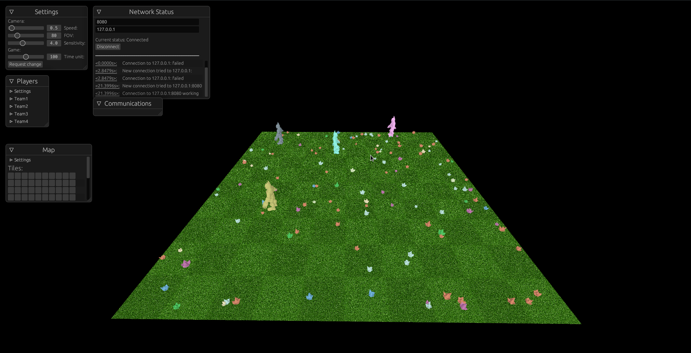

# Zappy



Last project of the second school year at epitech. Zappy is a game for developers, where players have to design AIs to make them fight together.

### Context

Zappy, is a project composed in three parts:

- the server
- the graphical interface
- the AI

The goal of the project is to make a network game where several teams compete in order to evolve as quickly as possible. 6 of their players have to reach the maximum level to make their team win. The players of each team must collect resources on the tiles in order to survive and evoluate.

Each part is independent and can be reused as long as the communication protocol is respected. For example, you can reference the [README](./zappy_server/README_GUI.md) in the zappy_server document which explains the different commands and responses the server can provide.

- Server part: Saves the progress of the game and communicates between the map and the players. Made in C
- Graphical part: Visual representation of the state of the game, it must display the map, its resources, the players as well as animate the actions of the players. Made in rust
- AI part: This is our implementation of a player. It aims to recreate a hive with fighters, workers and a queen. The behavior of our players can be very different depending on their role in the hive. Made in Python

### GamePlay

This world has an finite but circular map. While walking around the map, players can find food and different stones. Food is essential for the survival of the player because every 10 actions it allows 1 life point and if it drops to zero it dies. The only way for him not to die is to feed himself. Stones are used to allow players to level up. There are 6 stone categories:

- Linemate
- Deraumere
- Sibur
- Beggar
- Phiras
- Thystame

The server generates resources at startup and every 20 time units (defined by the parameters transmitted to the server at launch). Resources should be distributed evenly across the map.

More a player evolves, the further he can see, this is important to analyze the resources he needs for the future.

To pass a level, an incentation is made, it requires a specific number of players on the tile where the incantation is started and specific resources on the ground (not in the player's inventory). The players do not need to be on the same team for the cast. However the ritual can be stopped if during the incantation another player arrives on the space and pushes the players currently in ritual.

Players can communicate with each other but be careful when a player sends a message all the other players whether they are in the team or not receive the message. However they receive the direction from where the message originates and the message but do not receive the information of who transmitted the message.

 For more details refer to the [subject](./subjects).
## Quick Setup
### Server (C)
| Require c and Makefile

```bash
  cd zappy_server
  make
  ./zappy_server
```

### Ai (Python)
| Require python installed

```bash
  cd zappy_ai
  chmod +x zappy_ai.py
  ./zappy_ai.py
```
### Gui (Rust)
| Require [Rust](https://www.rust-lang.org/tools/install) and Cargo

```bash
  cd zappy_gui
  make
  ./zappy_gui [-p <port>] [-h <machine>]

_____________________

  cd zappy_gui
  cargo run -- [-p <port>] [-h <machine>]
```
## Documentation

### Zappy Server

[Gui protocol](./zappy_server/README_GUI.md)

[Ai protocol](./zappy_server/README_AI.md)

```
  doxygen // generate gui documentation, found at docs/html/index.html
```

### Zappy Gui Documentation

```bash
  cd ./zappy_gui/
  cargo doc  // generate gui documentation, found at target/doc/zappy_gui/index.html

  make doc-f // open rend-ox documentation in firefox
```
## Authors

- [Laetitia Bousch](https://github.com/Chasfory)
- [Auguste Frater](https://github.com/augustefrater)
- [Axel Denis](https://github.com/axel-denis)
- [Julian Scott](https://github.com/syborg64)
- [Ludovic De-Chavagnac](https://github.com/Ludofr3)
- [Arthur Aillet](https://github.com/Arthur-Aillet)

## Contributing

Contributions are always welcome!
The school year being over, the project sees its development completed, despite several bugs and limitations in the project. The graphic library **Rend-Ox** created for the occasion has for its part vocation to potentially continue its development, do not hesitate to continue your research on [this side](https://github.com/Arthur-Aillet/Rend-ox).
